# BUKU PANDUAN PENGGUNAAN SIM-TREN
## ROLE: ADMIN (SUPER ADMIN)

---

### DAFTAR ISI
1. **PENDAHULUAN**
2. **AKSES MASUK & DASHBOARD UTAMA**
3. **MANAJEMEN STAF & PENGGUNA**
4. **PENGELOLAAN DATA MASTER**
   - 4.1 Data Santri & Hubungan Orang Tua
   - 4.2 Data Ustadz
   - 4.3 Data Kelas & Kamar
5. **LAYANAN & ADMINISTRASI KEUANGAN**
   - 5.1 Pengaturan Jenis Layanan & Jenis Tagihan
   - 5.2 Manajemen Keuangan & Riwayat Layanan
6. **KEGIATAN PESANTREN**
7. **PENGADUAN & TIMBAL BALIK (FEEDBACK)**
8. **FITUR LAYANAN KESEHATAN**
   - 8.1 Screening Penyakit (Scabies)
   - 8.2 Observasi Cuci Tangan
   - 8.3 Absensi Kesehatan Kamar
9. **AUDIT LOG SISTEM & FAQ**

---

### 1. PENDAHULUAN
**SIM-Tren (Sistem Informasi Manajemen Pesantren)** adalah platform terintegrasi yang dirancang khusus untuk mempermudah tata kelola administrasi, kegiatan santri, dan layanan kesehatan di lingkungan Pondok Pesantren. 

Sebagai seorang **Admin (Super Admin)**, Anda memegang hak akses tertinggi di sistem ini. Tanggung jawab utama Anda meliputi konfigurasi sistem dasar, pengelolaan akun staf, pengelolaan data master santri/ustadz, serta pemantauan audit log seluruh aktivitas sistem.

---

### 2. AKSES MASUK & DASHBOARD UTAMA
Untuk masuk ke sistem sebagai Admin, ikuti langkah-langkah berikut:
1. Buka browser Anda dan akses tautan aplikasi.
2. Pada halaman masuk (Login), masukkan **Email Admin** (`admin@ppdny.id`) dan **Kata Sandi** Anda.
3. Klik tombol **Masuk**.
4. Sistem akan mengarahkan Anda langsung ke **Dashboard Admin**.

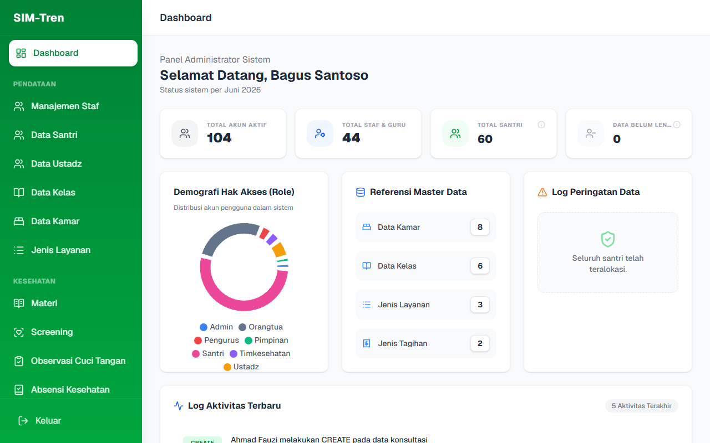

Di dalam **Dashboard Admin**, Anda dapat memantau visualisasi statistik cepat mengenai:
- Jumlah staf aktif, santri, dan ustadz.
- Ringkasan statistik kesehatan (grafik santri sehat vs sakit).
- Status penanganan pengaduan sistem secara real-time.

---

### 3. MANAJEMEN STAF & PENGGUNA
Fitur ini digunakan untuk mengelola hak akses seluruh staf operasional pesantren (Pimpinan, Pengurus, Tim Kesehatan, dan Ustadz).

**Langkah menambahkan staf baru:**
1. Klik menu **Manajemen Staf** pada sidebar.
2. Tekan tombol **Tambah Staf**.
3. Isi formulir yang tersedia: Nama Lengkap, Nomor HP, Email, dan pilih **Peran (Role)** yang sesuai.
4. Klik **Simpan**. Akun staf baru akan terbuat dan mereka dapat masuk ke sistem menggunakan email tersebut.

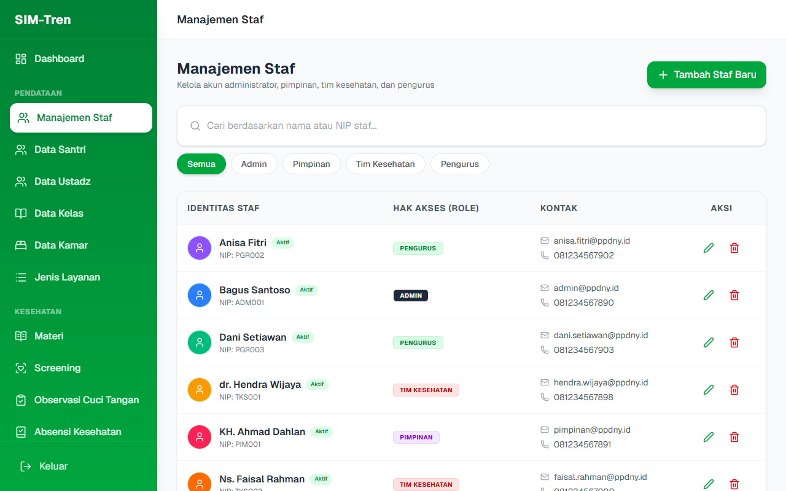

---

### 4. PENGELOLAAN DATA MASTER

#### 4.1 Data Santri & Hubungan Orang Tua
Menu ini menampilkan daftar seluruh santri yang terdaftar di pesantren. Anda dapat mengedit biodata santri serta menghubungkan santri dengan akun orang tuanya.
- **Tambah Santri**: Klik **Tambah Santri**, masukkan NIS, Nama, Kelas, Kamar, dan Foto.
- **Relasi Orang Tua**: Klik tombol aksi pada santri, lalu pilih **Hubungkan Orang Tua** untuk menetapkan siapa wali dari santri tersebut.

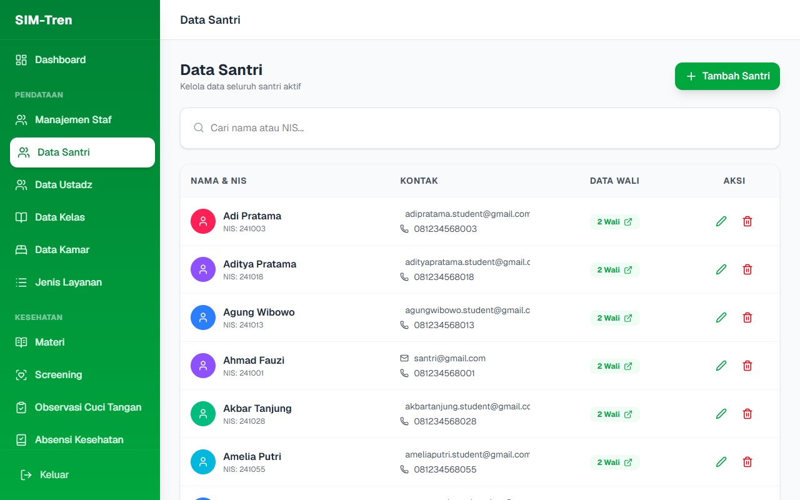
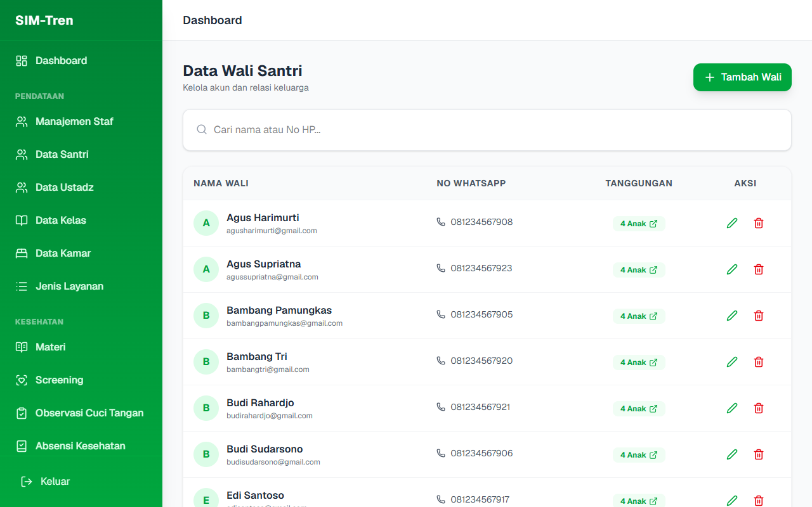

#### 4.2 Data Ustadz
Digunakan untuk mengelola informasi pengajar/ustadz di pesantren.
- Navigasi ke menu **Data Ustadz**.
- Di sini Anda dapat memantau status keaktifan ustadz, nomor kontak, serta mengedit detail profil ustadz.

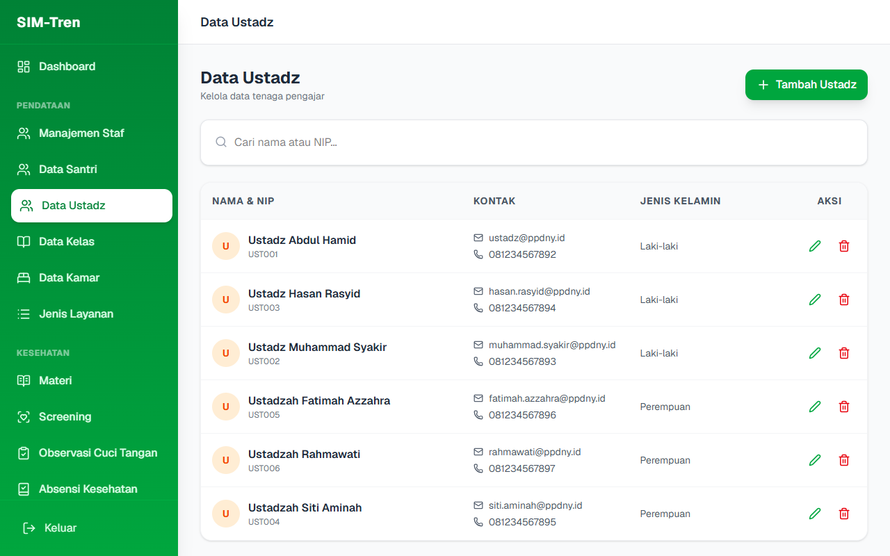

#### 4.3 Data Kelas & Kamar
Kelas dan Kamar (Asrama) adalah entitas penting untuk mengelompokkan santri dalam kegiatan belajar dan pengawasan kesehatan harian.
- **Data Kelas**: Menambah kelas baru dan mengalokasikan santri ke dalam kelas tersebut.
- **Data Kamar**: Menambah kamar baru, kapasitas maksimal, dan daftar santri penghuni kamar tersebut.

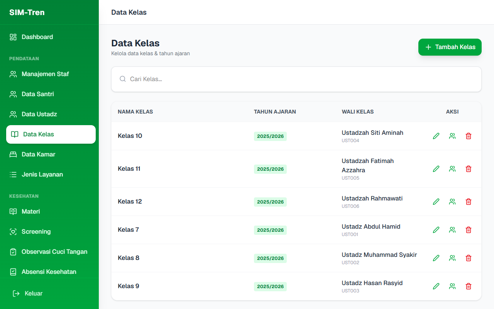
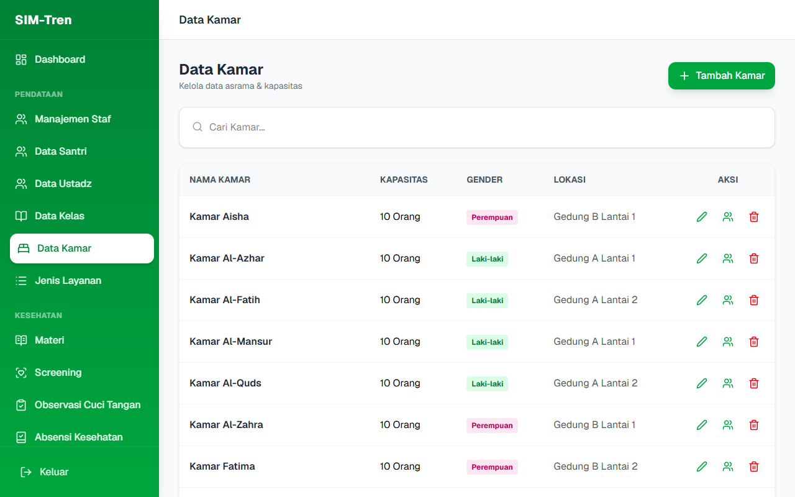

---

### 5. LAYANAN & ADMINISTRASI KEUANGAN

#### 5.1 Pengaturan Jenis Layanan & Jenis Tagihan
- **Jenis Layanan**: Digunakan untuk mendaftarkan opsi perawatan atau fasilitas kesehatan yang disediakan pesantren (contoh: Pemeriksaan Poskesren, Rujukan Puskesmas).
- **Jenis Tagihan**: Menentukan komponen pembiayaan bulanan santri (contoh: SPP Bulanan, Uang Makan, Iuran Kesehatan).

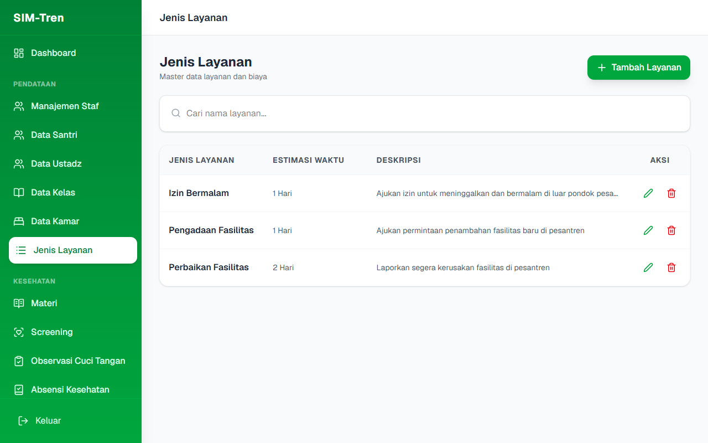
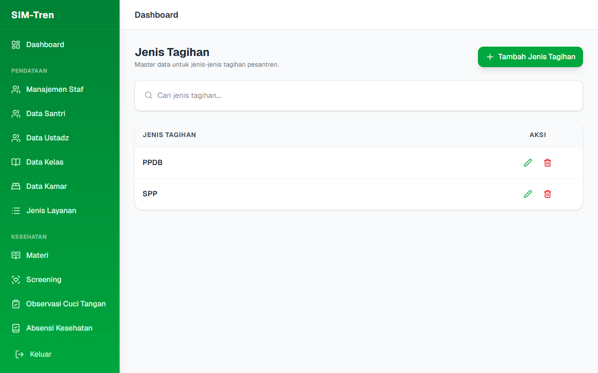

#### 5.2 Manajemen Keuangan & Riwayat Layanan
- **Keuangan**: Menu ini berfungsi untuk melacak riwayat pembayaran tagihan oleh wali santri, menyetujui (konfirmasi) bukti pembayaran transfer, dan memantau status tunggakan keuangan santri.
- **Riwayat Layanan**: Rekam medis/layanan sosial yang pernah diterima oleh santri selama di pesantren.

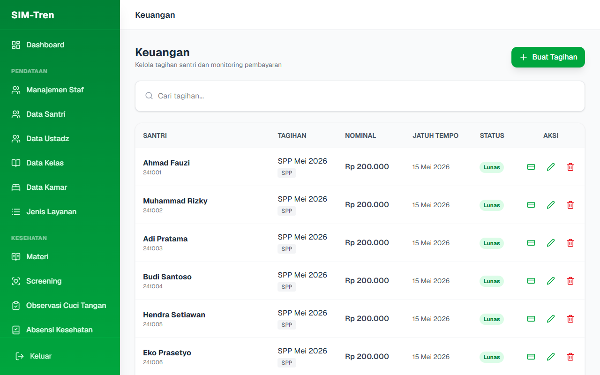
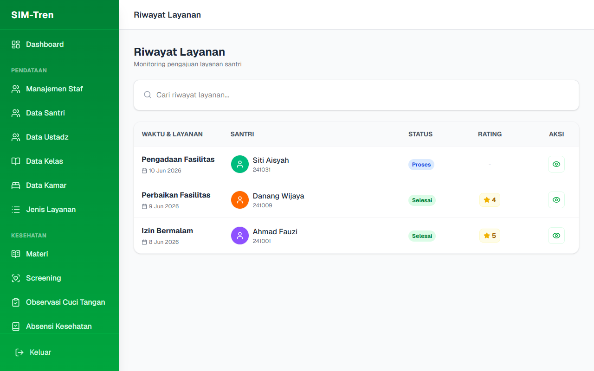

---

### 6. KEGIATAN PESANTREN
Admin dapat menjadwalkan, mengedit, atau menghapus agenda kegiatan pesantren baik yang bersifat akademik, keagamaan, maupun gotong-royong kebersihan.
1. Masuk ke menu **Kegiatan**.
2. Klik **Tambah Kegiatan** untuk membuat agenda baru.
3. Masukkan judul kegiatan, tanggal pelaksanaan, deskripsi, dan lampiran gambar jika ada.
4. Klik **Kirim**.

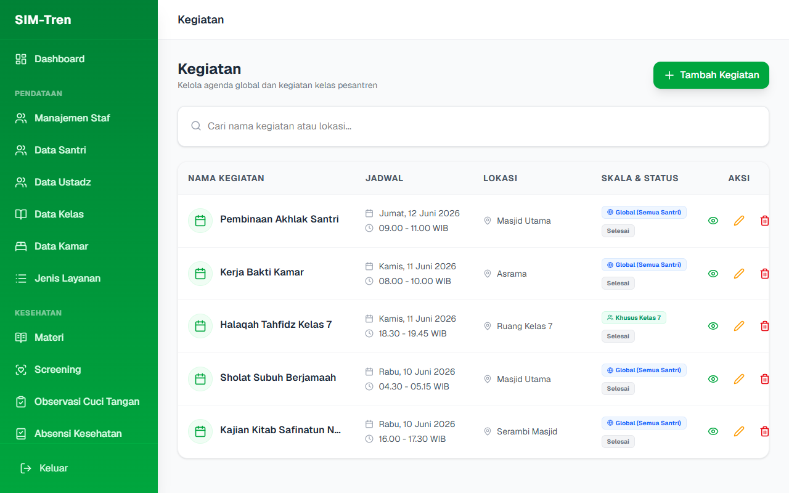

---

### 7. PENGADUAN & TIMBAL BALIK (FEEDBACK)
Menu ini memfasilitasi komunikasi antara wali santri dengan pihak pengelola pesantren:
- **Pengaduan**: Laporan keluhan dari wali santri mengenai fasilitas atau kondisi santri. Sebagai admin, Anda dapat mengubah status aduan (Menunggu -> Diproses -> Selesai) serta memberikan catatan tindak lanjut.
- **Feedback**: Penilaian bintang dan ulasan yang diberikan pengguna aplikasi untuk mengevaluasi kualitas layanan pesantren.

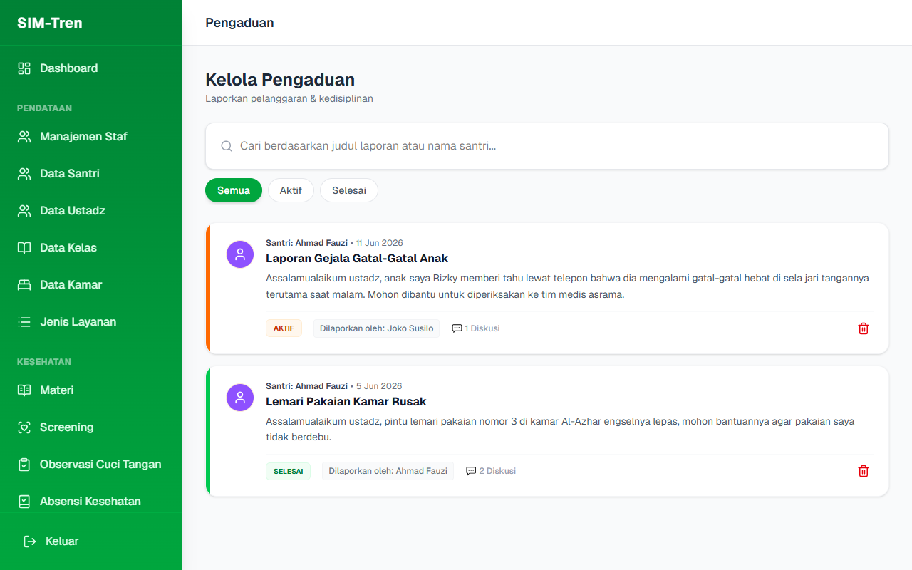
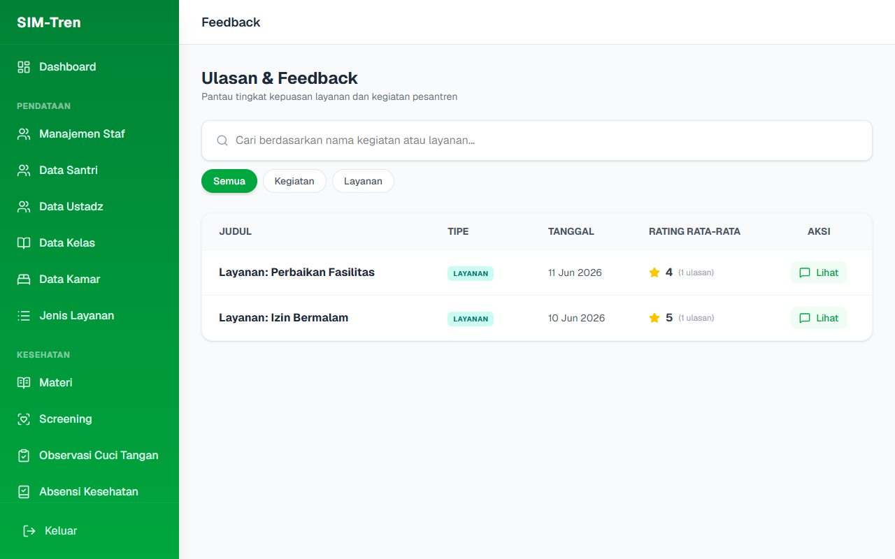

---

### 8. FITUR LAYANAN KESEHATAN

#### 8.1 Screening Penyakit (Scabies)
Fitur unggulan untuk melakukan screening gejala awal penyakit kulit scabies pada santri:
1. Pilih menu **Screening**.
2. Klik nama santri yang akan di-screen.
3. Centang indikator gejala klinis (contoh: gatal malam hari, bintik merah, penularan teman sekamar).
4. Ambil keputusan diagnosis berdasarkan panduan medis terintegrasi.

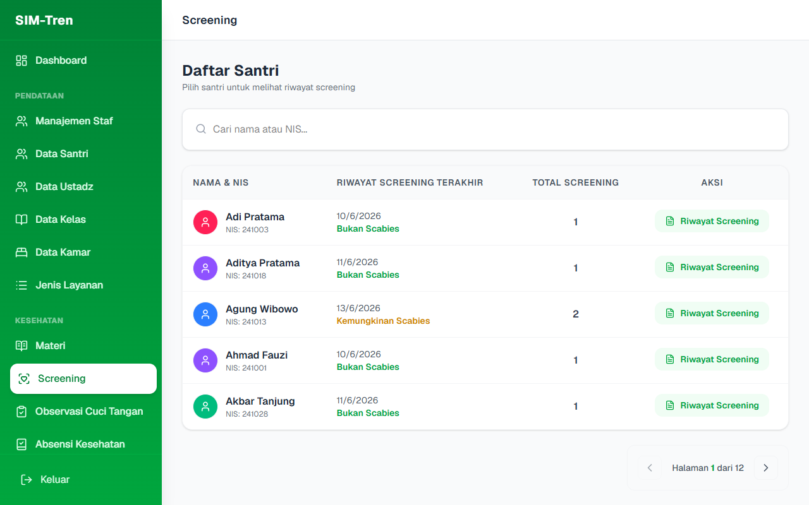

#### 8.2 Observasi Cuci Tangan
Pencatatan kepatuhan sanitasi santri (terutama perilaku mencuci tangan dengan sabun):
- Digunakan untuk memantau kepatuhan santri terhadap 6 langkah cuci tangan menurut WHO sebagai upaya pencegahan penularan penyakit menular.

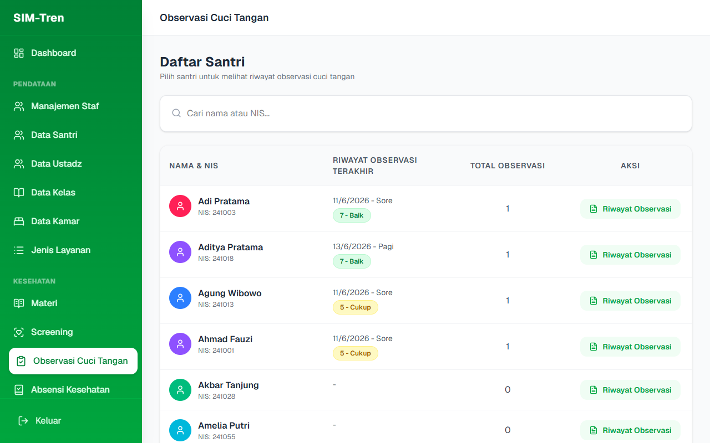

#### 8.3 Absensi Kesehatan Kamar
Pencatatan laporan santri sakit langsung per kamar asrama secara harian:
- Mempermudah tim kesehatan mendeteksi penularan penyakit menular (seperti scabies atau influenza) dalam satu kamar secara dini.

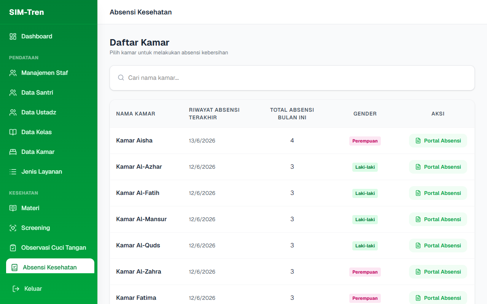

---

### 9. AUDIT LOG SISTEM & FAQ
- **Log Aktivitas**: Menampilkan seluruh riwayat operasi database (siapa yang mengubah data, kapan, dan perubahan apa yang dilakukan). Ini sangat berguna untuk menjaga keamanan data pesantren.
- **FAQ (Tanya Jawab)**: Kumpulan dokumen panduan pemecahan masalah cepat bagi pengguna aplikasi.

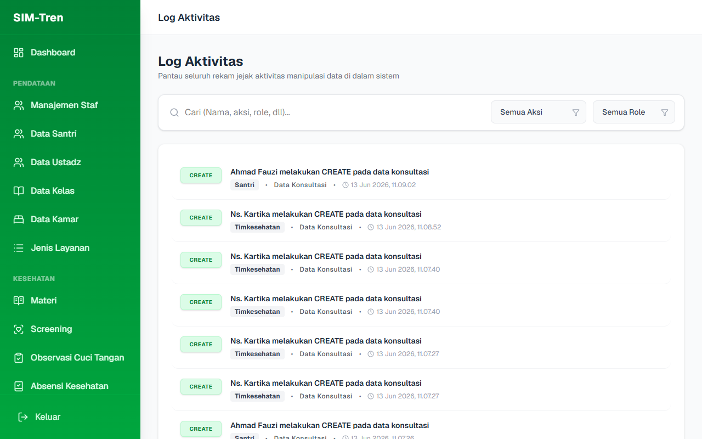
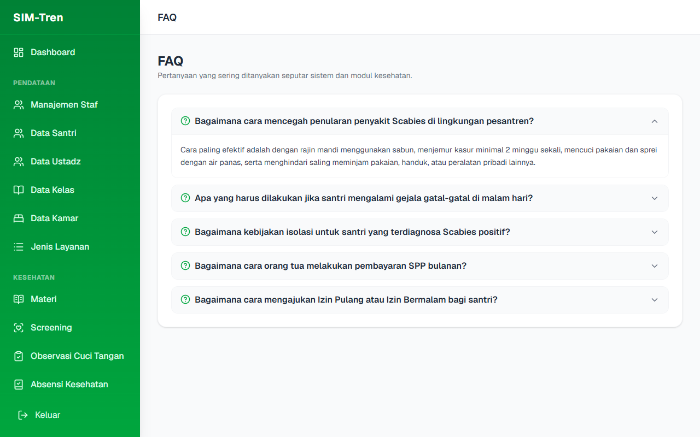
