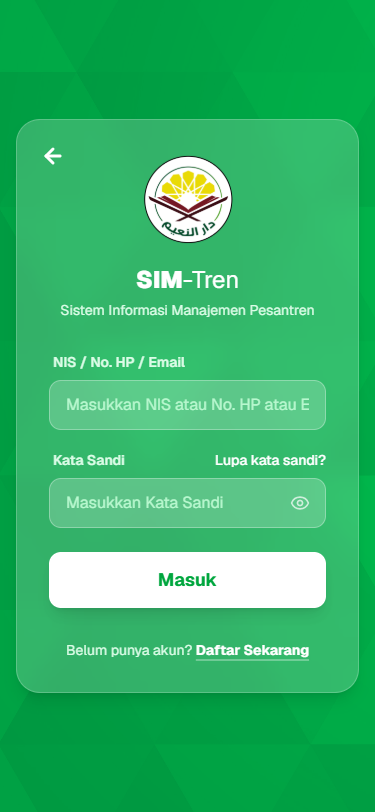

# BUKU PANDUAN PENGGUNAAN SIM-TREN
## ROLE: WALI SANTRI (ORANG TUA)

---

### DAFTAR ISI
1. **PENDAHULUAN**
2. **CARA LOGIN & INSTALASI APLIKASI (PWA)**
3. **MEMAHAMI DASHBOARD ORANG TUA**
4. **MEMANTAU KESEHATAN & RIWAYAT SCABIES ANAK**
5. **MEMANTAU KEGIATAN & PERKEMBANGAN SANTRI**
6. **PEMBAYARAN SPP & KEUANGAN SANTRI**
7. **PANDUAN MENGAJUKAN PENGADUAN & KELUHAN**
8. **KONSULTASI KESEHATAN ONLINE**

---

### 1. PENDAHULUAN
Selamat datang Wali Santri di **SIM-Tren (Sistem Informasi Manajemen Pesantren)**! 

Aplikasi ini disediakan khusus agar Anda dapat memantau kesehatan anak (santri) secara real-time dari rumah, mengawasi kegiatan harian anak, menyelesaikan pembayaran SPP bulanan, dan melakukan pengaduan atau konsultasi langsung dengan tim kesehatan pondok pesantren secara instan.

---

### 2. CARA LOGIN & INSTALASI APLIKASI (PWA)
SIM-Tren menggunakan teknologi **Progressive Web App (PWA)**. Artinya, Anda dapat menginstal aplikasi ini langsung di layar utama smartphone Android atau iPhone Anda tanpa melalui Play Store/App Store.

**Cara Menginstal & Masuk:**
1. Buka browser di smartphone Anda, lalu akses alamat website SIM-Tren (`https://ppdny.vercel.app`).
2. Ketuk banner **"Install SIM-Tren"** yang muncul di bagian bawah layar handphone Anda, lalu ikuti instruksinya.
3. Setelah terpasang, buka aplikasi SIM-Tren di HP Anda.
4. Masukkan **Email Orang Tua** (`bapak@gmail.com`) dan **Kata Sandi** Anda (`password123`).
5. Klik **Masuk**.

---

### 3. MEMAHAMI DASHBOARD ORANG TUA
Setelah berhasil masuk, Anda akan melihat halaman **Dashboard Orang Tua**. Dashboard ini didesain ringkas untuk kenyamanan akses melalui smartphone Anda.

Pada bagian atas dashboard, Anda dapat melihat informasi:
- **Nama Anak Anda** beserta NIS, Kelas, dan Kamar Asramanya.
- *Catatan*: Jika Anda memiliki lebih dari satu anak yang bersekolah di pesantren ini, Anda dapat beralih akun santri dengan mengetuk pilihan dropdown nama anak yang tersedia.
- Pintasan menu utama: Keuangan, Kegiatan, Aduan, dan Kesehatan (Scabies).
- Ringkasan tagihan yang jatuh tempo dan rekam medis harian anak Anda.

---

### 4. MEMANTAU KESEHATAN & RIWAYAT SCABIES ANAK
Kesehatan anak adalah prioritas utama. Melalui menu **Kesehatan**, Anda dapat:
- Melihat ringkasan kondisi medis terbaru anak Anda.
- Membaca hasil diagnosis screening scabies berkala yang dilakukan tim medis pesantren.
- Memantau skor kepatuhan cuci tangan anak Anda sebagai indikator pencegahan penularan parasit kulit.

---

### 5. MEMANTAU KEGIATAN & PERKEMBANGAN SANTRI
Untuk melihat agenda kegiatan apa saja yang sedang diikuti oleh anak Anda di pesantren:
1. Ketuk menu **Kegiatan** di Dashboard.
2. Anda dapat melihat daftar kalender kegiatan akademik, ekstrakurikuler, kajian, maupun kegiatan gotong royong kebersihan kamar.
3. Detail kehadiran atau absensi anak Anda dalam kegiatan tersebut juga akan dicatat secara berkala.

---

### 6. PEMBAYARAN SPP & KEUANGAN SANTRI
Melalui menu **Keuangan**, Anda dapat melunasi kewajiban administrasi sekolah anak tanpa perlu datang langsung ke pesantren:
1. Ketuk menu **Keuangan**.
2. Anda akan melihat daftar tagihan aktif (SPP Bulanan, Iuran Asrama, dll.) beserta nominalnya.
3. Klik tombol **Bayar** pada tagihan yang ingin dibayar.
4. Lakukan transfer bank sesuai dengan instruksi rekening tujuan yang tertera.
5. Unggah foto bukti transfer ATM atau screenshot mobile banking Anda sebagai bukti pelunasan.
6. Klik **Kirim**. Status pembayaran akan berubah menjadi "Menunggu Verifikasi" hingga diverifikasi oleh pengurus pondok pesantren.

---

### 7. PANDUAN MENGAJUKAN PENGADUAN & KELUHAN
Apabila Anda mendapati fasilitas asrama anak yang rusak, atau keluhan kenyamanan belajar santri, Anda dapat mengirim laporan aduan resmi:
1. Masuk ke menu **Aduan** di dashboard.
2. Ketuk tombol **Buat Aduan Baru**.
3. Tulis judul pengaduan dan deskripsikan keluhan Anda secara jelas. Anda juga bisa melampirkan foto kondisi kerusakan jika diperlukan.
4. Klik **Kirim Aduan**.
5. Anda dapat memantau proses penyelesaian aduan ini secara berkala melalui status laporan (Menunggu -> Diproses -> Selesai).

---

### 8. KONSULTASI KESEHATAN ONLINE
Apabila anak Anda terindikasi sakit di pesantren (misal: terdiagnosa gejala awal scabies), Anda dapat melakukan konsultasi jarak jauh dengan tim poskesren:
- Buka menu **Profil** atau **Kontak Tim Medis** di dashboard.
- Anda dapat memulai ruang obrolan (chatting) langsung dengan dokter/perawat pondok untuk mengetahui perkembangan penyembuhan anak Anda serta memberikan persetujuan jika diperlukan tindakan rujukan medis ke luar pesantren.
- Anda juga dapat memperbarui informasi kontak WhatsApp Anda pada menu **Profil** agar tim medis pesantren dapat menghubungi Anda dalam keadaan darurat.

