# BUKU PANDUAN PENGGUNAAN SIM-TREN
## ROLE: PENGURUS PONDOK

---

### DAFTAR ISI
1. **PENDAHULUAN**
2. **AKSES MASUK & DASHBOARD UTAMA**
3. **PENGELOLAAN DATA MASTER ASRAMA & AKADEMIK**
   - 3.1 Manajemen Data Kamar
   - 3.2 Manajemen Data Kelas
4. **PENGELOLAAN DATA PENGGUNA (SANTRI, ORANG TUA, USTADZ)**
5. **MANAJEMEN KEGIATAN PESANTREN**
6. **ADMINISTRASI LAYANAN & ADMINISTRASI KEUANGAN**
   - 6.1 Jenis Layanan & Jenis Tagihan
   - 6.2 Manajemen Transaksi & Laporan Keuangan
7. **FAQ**

---

### 1. PENDAHULUAN
**SIM-Tren (Sistem Informasi Manajemen Pesantren)** memberikan kemudahan bagi pengurus dalam mengatur kegiatan operasional, asrama, kelas, dan administrasi keuangan santri.

Sebagai **Pengurus Pondok**, Anda memiliki kewenangan operasional harian. Tugas utama Anda meliputi penataan pembagian kamar asrama santri, pembagian kelas, penjadwalan kegiatan pesantren, serta memverifikasi transaksi pembayaran SPP dan uang saku santri.

---

### 2. AKSES MASUK & DASHBOARD UTAMA
1. Buka aplikasi SIM-Tren di browser Anda.
2. Masukkan **Email Pengurus** (`pengurus@ppdny.id`) dan **Kata Sandi** Anda.
3. Klik **Masuk**.
4. Anda akan diarahkan ke **Dashboard Pengurus**.

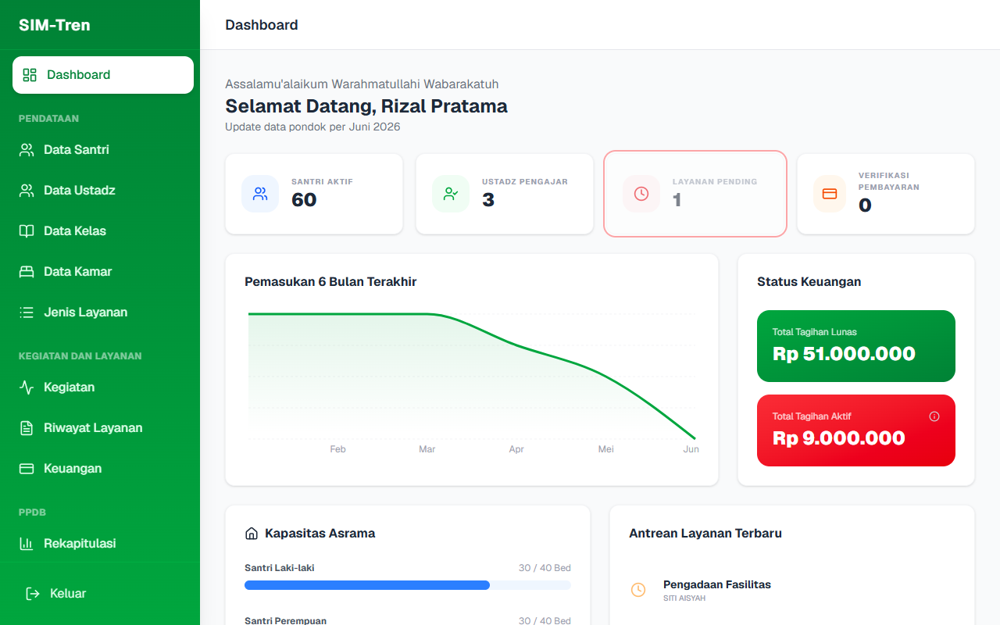

Dashboard ini menyajikan data operasional harian yang ringkas:
- Grafik keterisian kamar asrama.
- Statistik kehadiran santri dalam kegiatan terbaru.
- Ringkasan transaksi pembayaran keuangan santri hari ini.

---

### 3. PENGELOLAAN DATA MASTER ASRAMA & AKADEMIK

#### 3.1 Manajemen Data Kamar
Menu ini digunakan untuk mengatur pembagian asrama santri:
- **Tambah Kamar**: Daftarkan nama kamar/gedung baru beserta kuota kapasitas tidurnya.
- **Alokasi Santri**: Tentukan kamar asrama masing-masing santri untuk mempermudah pemantauan sanitasi dan kesehatan.

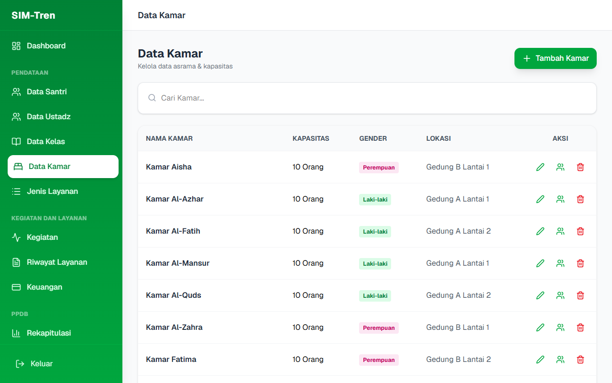

#### 3.2 Manajemen Data Kelas
Digunakan untuk mengelola kelompok belajar santri secara akademik:
- Daftarkan nama kelas baru.
- Masukkan santri ke dalam kelas belajar masing-masing sesuai jenjang pendidikannya.

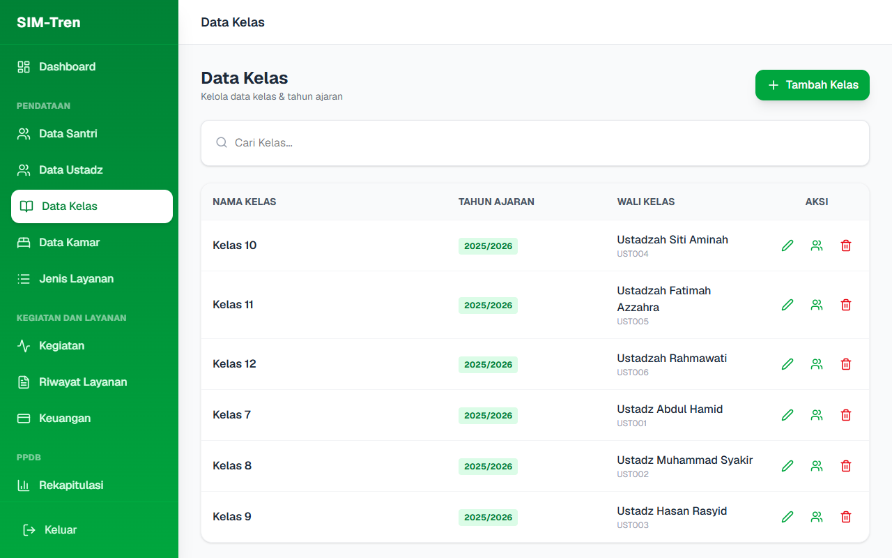

---

### 4. PENGELOLAAN DATA PENGGUNA (SANTRI, ORANG TUA, USTADZ)
Pengurus bertanggung jawab untuk melakukan pembaruan berkala data diri santri, wali santri, dan ustadz:
- **Data Santri**: Daftarkan santri baru, ganti status keaktifan santri, atau pindahkan santri ke kelas/kamar lain.
- **Data Orang Tua**: Kelola data nomor kontak wali santri yang digunakan untuk pemberitahuan aduan atau tagihan keuangan.
- **Data Ustadz**: Tambah pengajar baru dan tetapkan kelas bimbingan mereka.

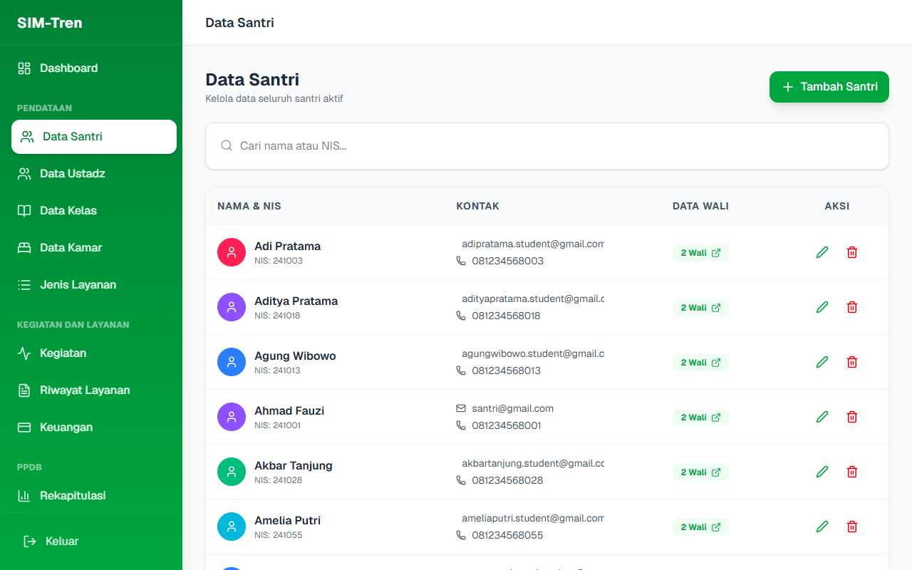
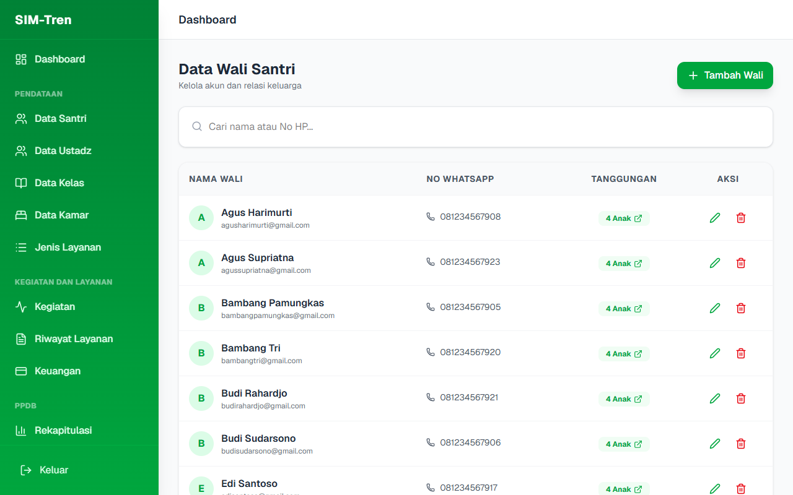
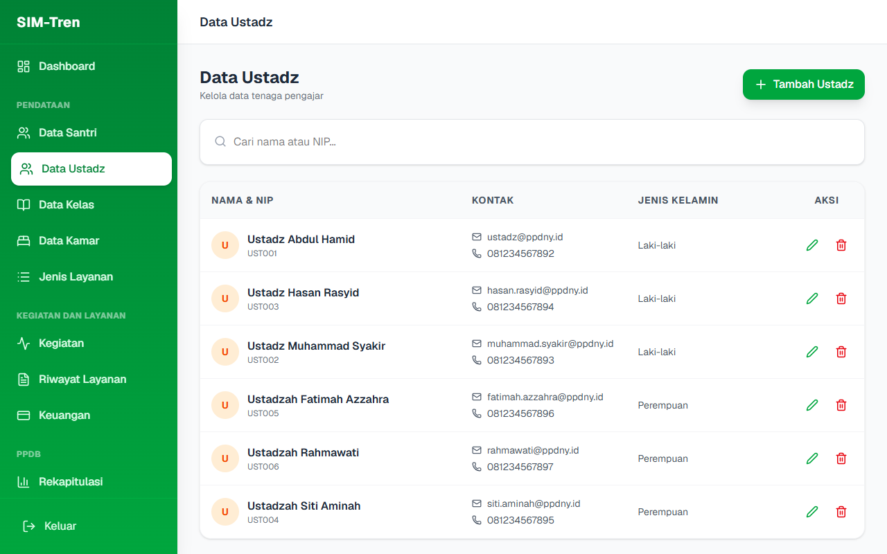

---

### 5. MANAJEMEN KEGIATAN PESANTREN
Untuk menjaga kedisiplinan dan keteraturan, Pengurus dapat membuat agenda kegiatan pesantren:
1. Masuk ke menu **Kegiatan**.
2. Klik tombol **Tambah Kegiatan**.
3. Isi detail berupa Judul Kegiatan (misal: "Pengajian Rutin Ahad Pagi", "Gotong Royong Bersih Asrama"), pilih Tanggal, Waktu, dan deskripsi kegiatan.
4. Klik **Kirim**. Seluruh santri dan orang tua akan mendapatkan informasi agenda baru ini pada dashboard mereka masing-masing.

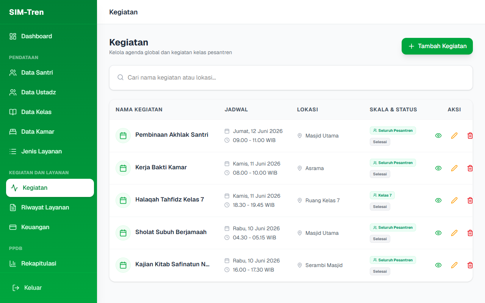

---

### 6. ADMINISTRASI LAYANAN & ADMINISTRASI KEUANGAN

#### 6.1 Jenis Layanan & Jenis Tagihan
- **Jenis Layanan**: Digunakan untuk menetapkan biaya pelayanan eksternal pesantren (contoh: biaya antar jemput, laundri tambahan).
- **Jenis Tagihan**: Pengurus dapat mendefinisikan komponen tagihan wajib bulanan santri.

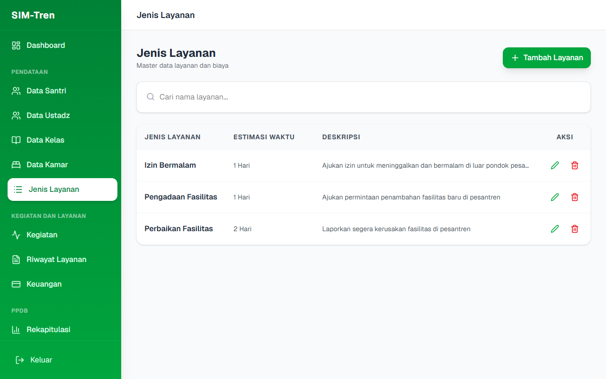
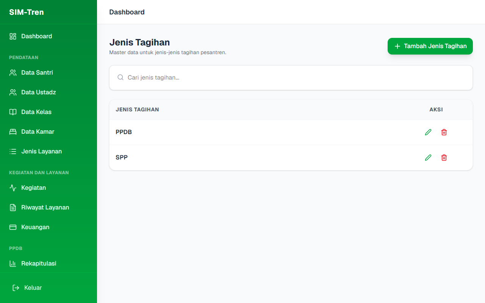

#### 6.2 Manajemen Transaksi & Laporan Keuangan
- **Keuangan**: Pengurus dapat melihat invoice tagihan dari setiap santri. Ketika wali santri mengunggah bukti pembayaran, Pengurus dapat meninjau lampiran gambar transfer dan melakukan **Verifikasi Pembayaran** agar status tagihan berubah menjadi **Lunas**.
- **Riwayat Layanan**: Rekam jejak layanan berbayar maupun kesehatan yang telah diajukan dan dinikmati oleh santri.

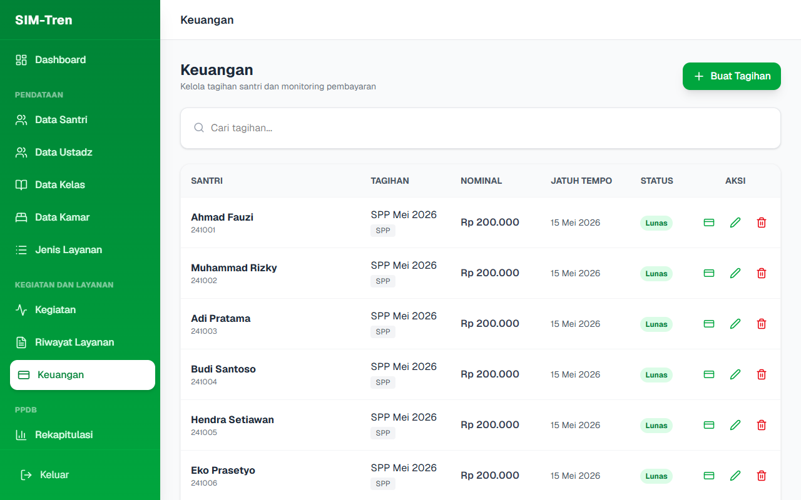
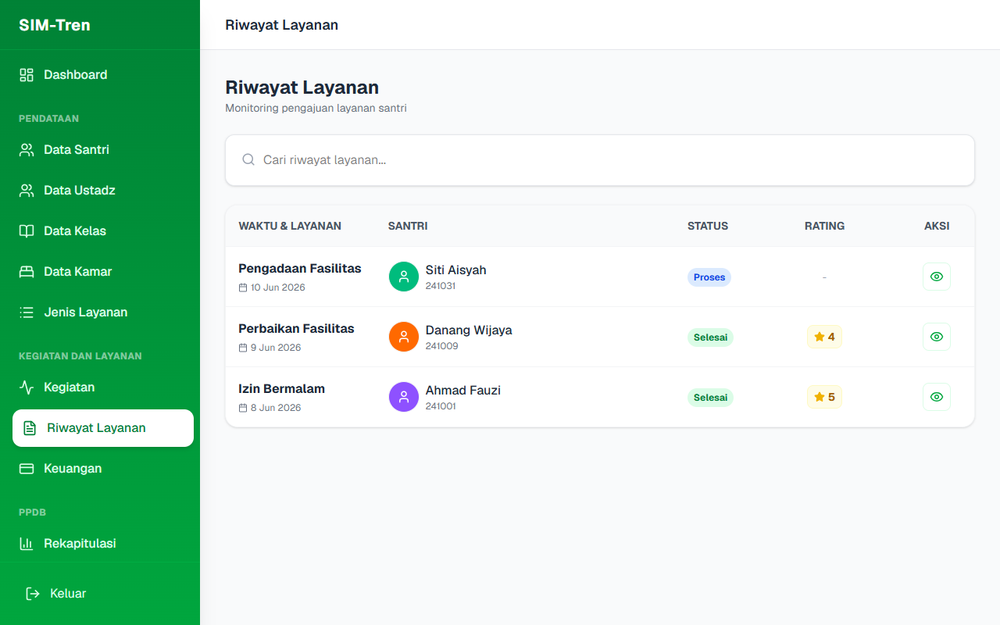

---

### 7. FAQ
Berisi rangkuman cara mengatasi masalah teknis operasional harian aplikasi bagi Pengurus.

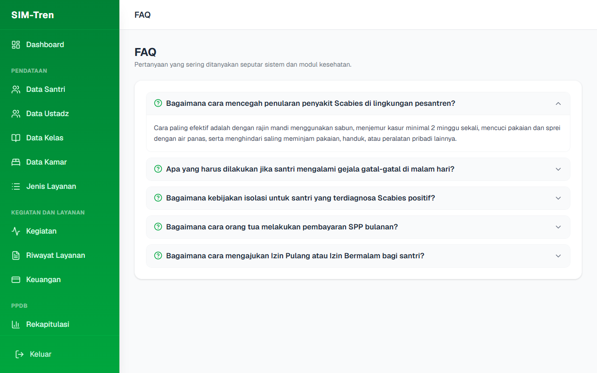
