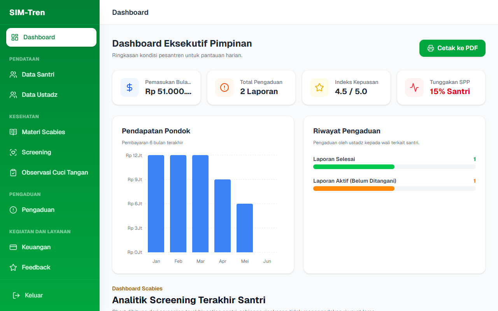
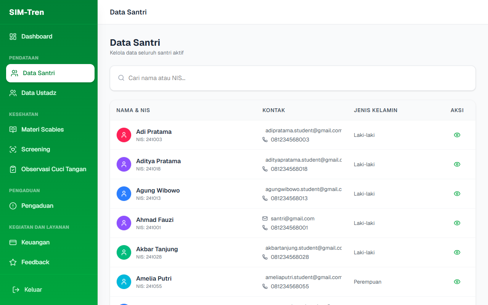
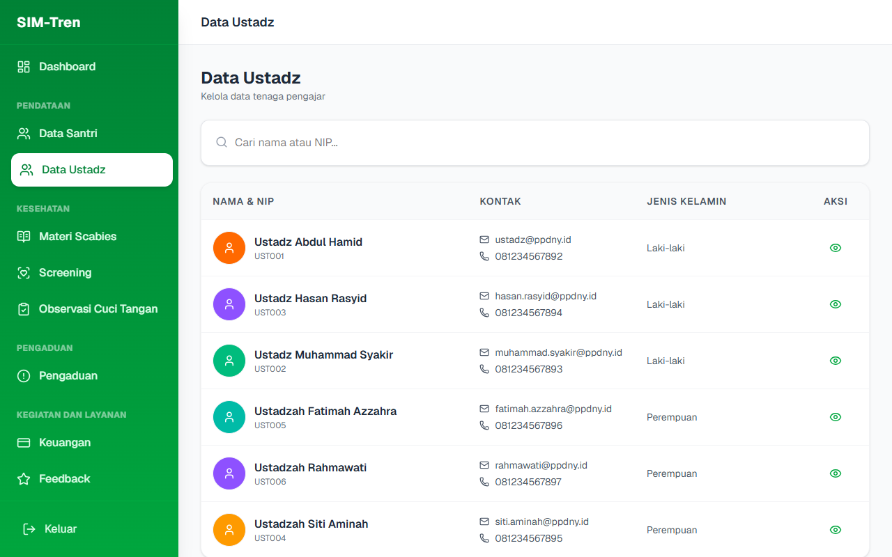
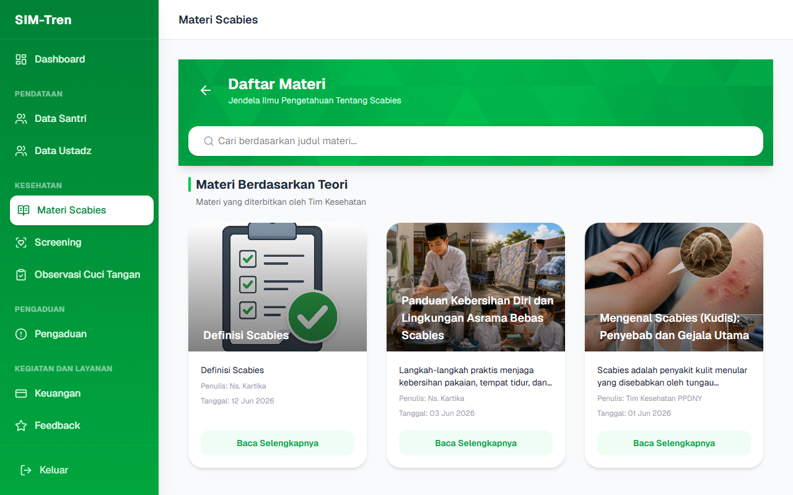
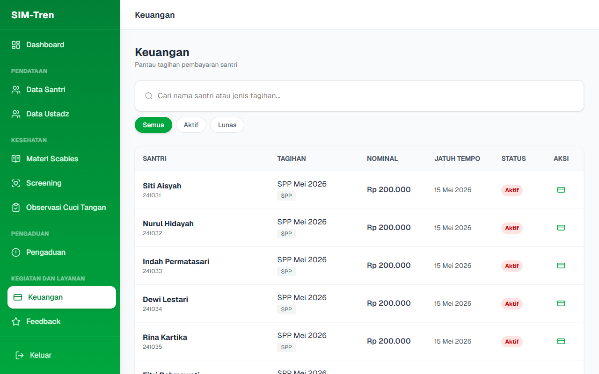
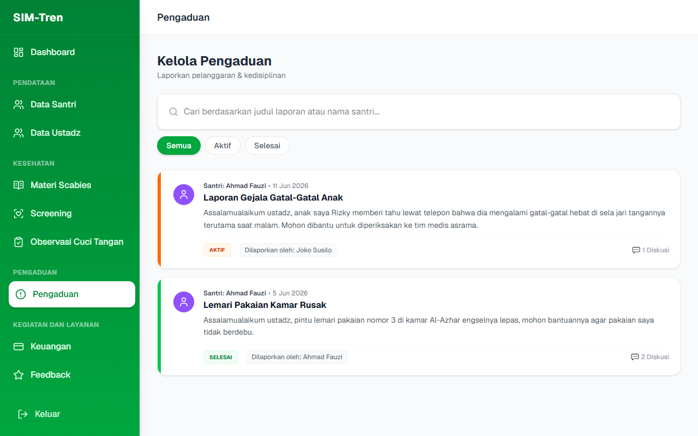
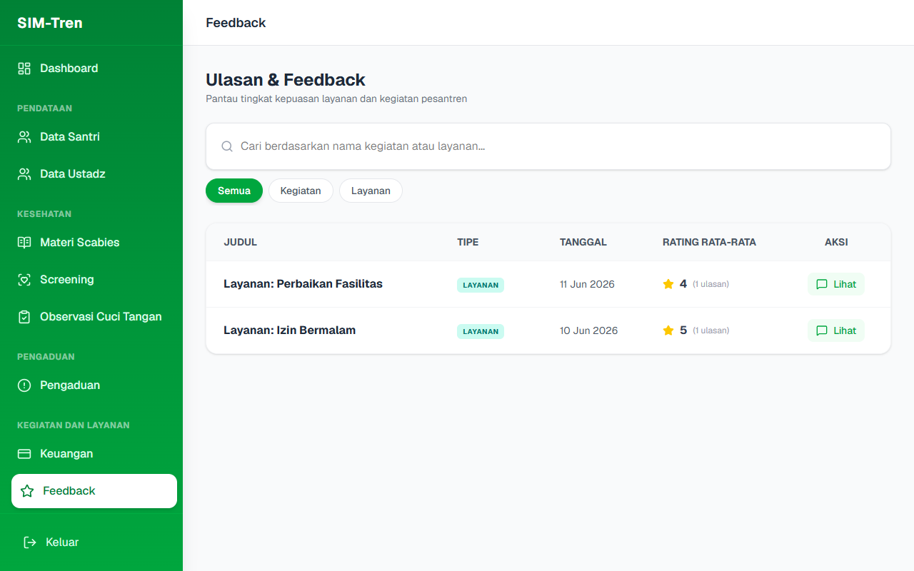
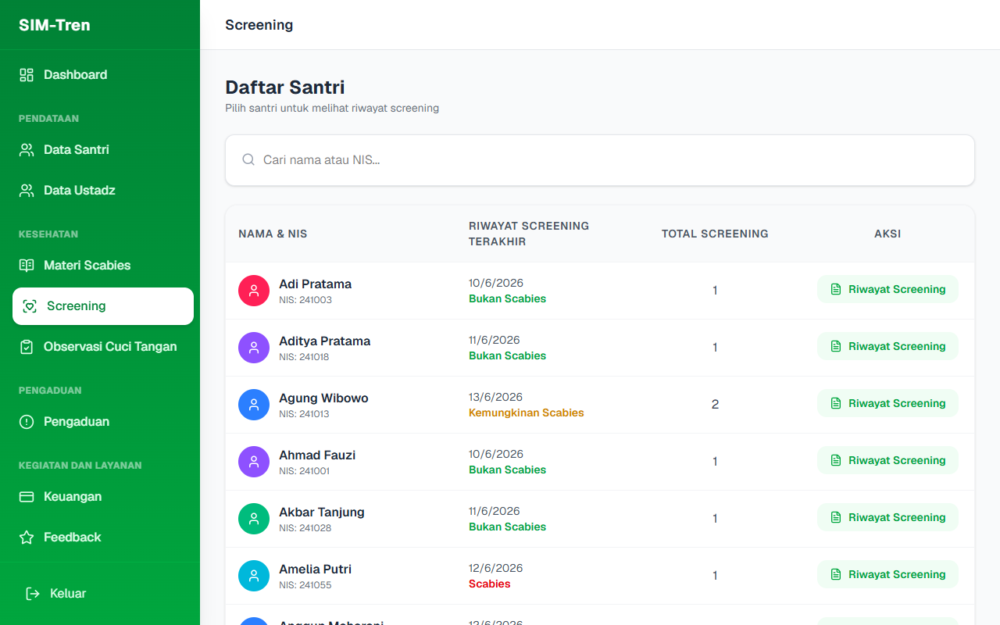
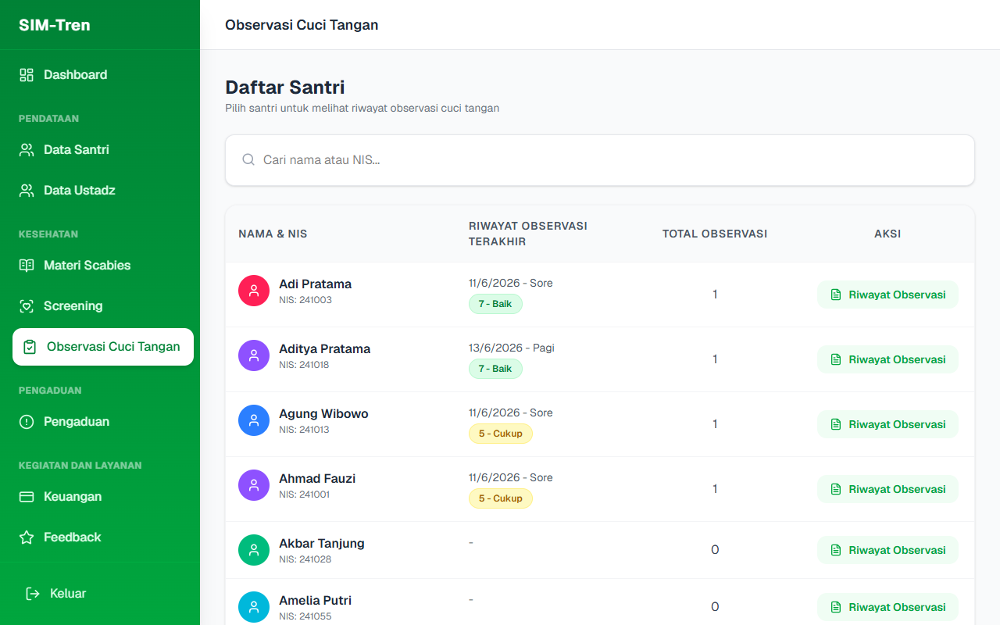
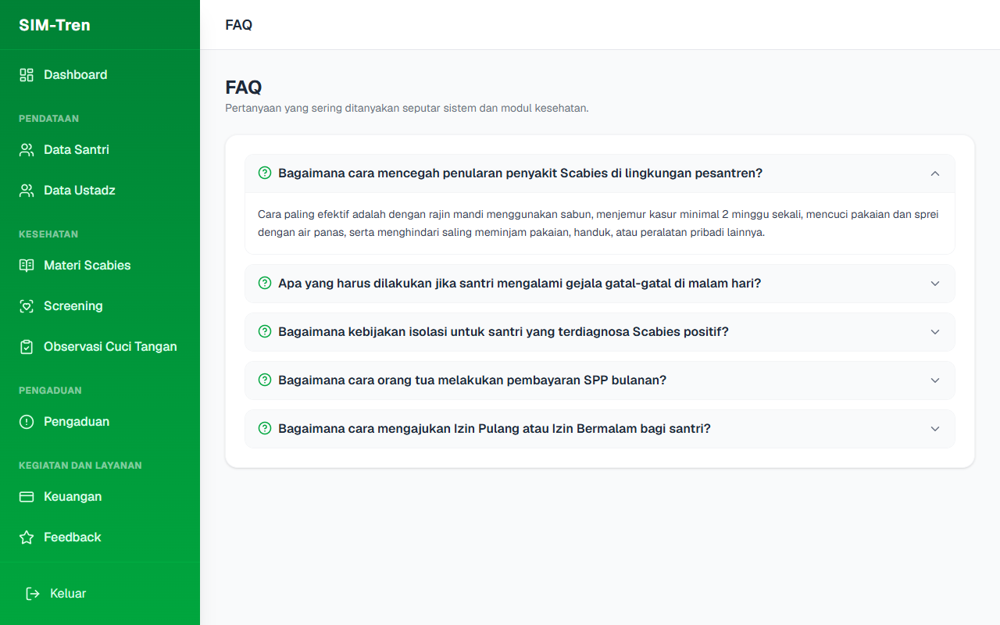

# BUKU PANDUAN PENGGUNAAN SIM-TREN
## ROLE: PIMPINAN

---

### DAFTAR ISI
1. **PENDAHULUAN**
2. **AKSES MASUK & MONITORING DASHBOARD UTAMA**
3. **PEMANTAUAN DATA SANTRI & USTADZ**
4. **EDUKASI & MANAJEMEN MATERI SCABIES**
5. **PENGAWASAN LAPORAN KEUANGAN**
6. **PEMANTAUAN PENGADUAN WALI SANTRI & FEEDBACK**
7. **PEMANTAUAN SCREENING & OBSERVASI KESEHATAN**
8. **FAQ**

---

### 1. PENDAHULUAN
**SIM-Tren (Sistem Informasi Manajemen Pesantren)** dirancang untuk menyajikan transparansi data di lingkungan pondok pesantren secara komprehensif.

Sebagai **Pimpinan Pesantren**, Anda memiliki akses khusus untuk memantau (view-only) semua dinamika pesantren tanpa khawatir merusak konfigurasi sistem. Peran utama Anda adalah memantau tren perkembangan kesehatan santri (terutama penanganan wabah scabies), mengawasi kesehatan finansial pesantren melalui visualisasi grafik yang intuitif, serta merespons aduan dan feedback wali santri.

---

### 2. AKSES MASUK & MONITORING DASHBOARD UTAMA
1. Buka halaman utama aplikasi SIM-Tren di browser Anda.
2. Masukkan **Email Pimpinan** (`pimpinan@ppdny.id`) dan **Kata Sandi** Anda.
3. Klik tombol **Masuk**.
4. Sistem akan mengarahkan Anda ke **Dashboard Pimpinan**.

Dashboard Pimpinan memprioritaskan penyajian visual data ringkas berupa kartu informasi dan grafik statistik, antara lain:
- Total Santri Aktif dan Total Ustadz.
- Indikator Tren Scabies Bulanan (Grafik garis kenaikan/penurunan kasus).
- Jumlah aduan masuk yang membutuhkan perhatian segera.

---

### 3. PEMANTAUAN DATA SANTRI & USTADZ
Pimpinan memiliki menu khusus untuk melihat profil lengkap seluruh civitas pesantren secara cepat:
- **Data Santri**: Melihat biodata santri, status kelas, kamar, nama wali, serta riwayat pelanggaran atau layanan kesehatan yang diterima.
- **Data Ustadz**: Memantau daftar pengajar aktif di pesantren lengkap dengan kontak yang bisa dihubungi.

---

### 4. EDUKASI & MANAJEMEN MATERI SCABIES
SIM-Tren mengintegrasikan modul edukasi untuk memutus mata rantai penularan scabies:
- Melalui menu **Materi Scabies**, Pimpinan dapat meninjau modul edukasi (artikel, panduan kebersihan) yang dipublikasikan oleh tim kesehatan untuk santri dan orang tua.
- Hal ini membantu Pimpinan memastikan materi edukasi pencegahan scabies selalu diperbarui secara berkala.

---

### 5. PENGAWASAN LAPORAN KEUANGAN
Menu Keuangan untuk Pimpinan menampilkan laporan neraca saldo, rekapitulasi pembayaran SPP bulanan, dan visualisasi grafik perputaran uang masuk dan keluar.
- Anda dapat menyaring data keuangan berdasarkan rentang tanggal tertentu.
- Membantu Pimpinan dalam mengambil keputusan strategis terkait pengalokasian anggaran operasional pesantren.

---

### 6. PEMANTAUAN PENGADUAN WALI SANTRI & FEEDBACK
Untuk menjamin kualitas pelayanan, Pimpinan dapat memantau aspirasi wali santri secara real-time:
- **Pengaduan**: Memantau keluhan yang diajukan wali santri beserta tanggapan/status penyelesaian yang dikerjakan oleh staf.
- **Feedback**: Mengukur kepuasan wali santri terhadap sistem pelayanan pondok secara keseluruhan melalui penilaian rating bintang.

---

### 7. PEMANTAUAN SCREENING & OBSERVASI KESEHATAN
Pimpinan dapat memantau secara berkala hasil pemeriksaan kesehatan santri secara transparan:
- **Screening**: Laporan hasil diagnosis scabies dari tim medis. Anda dapat memantau nama santri yang terindikasi scabies agar dapat segera diinstruksikan karantina kamar/asrama.
- **Observasi Cuci Tangan**: Grafik dan rekam data kepatuhan cuci tangan santri sebagai bentuk pencegahan penyebaran penyakit menular.

---

### 8. FAQ
Modul ini menyediakan jawaban praktis atas kendala-kendala umum penggunaan aplikasi SIM-Tren di lapangan.

