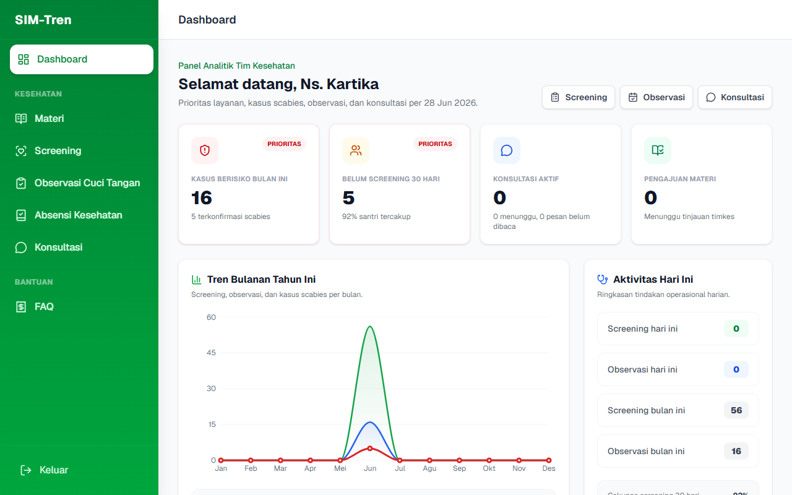
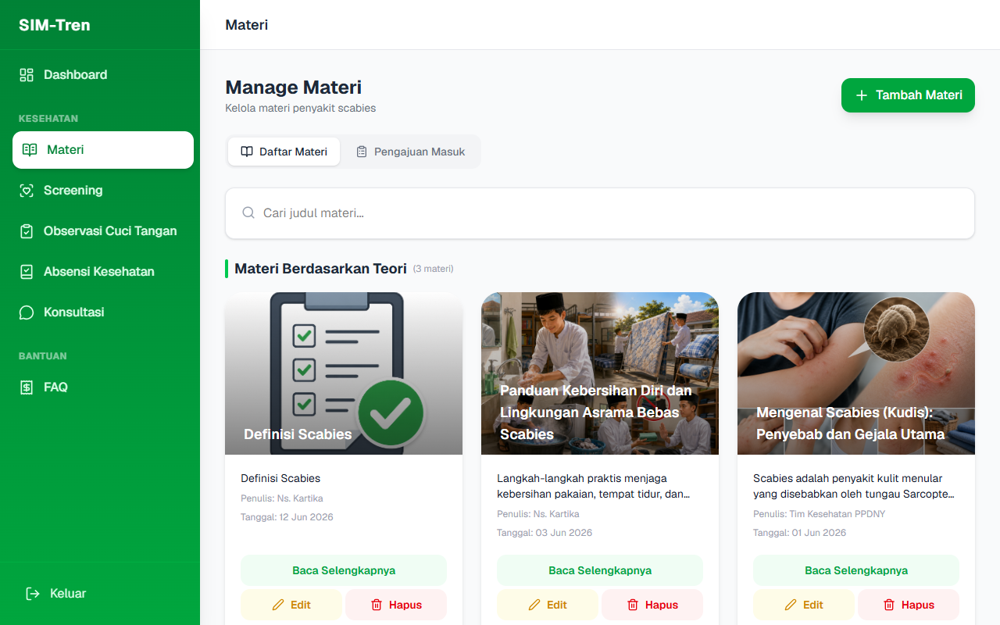
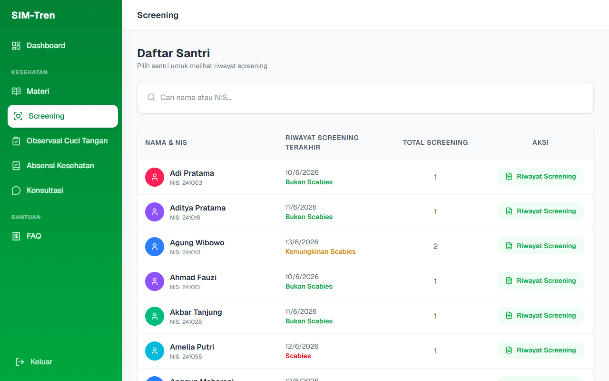
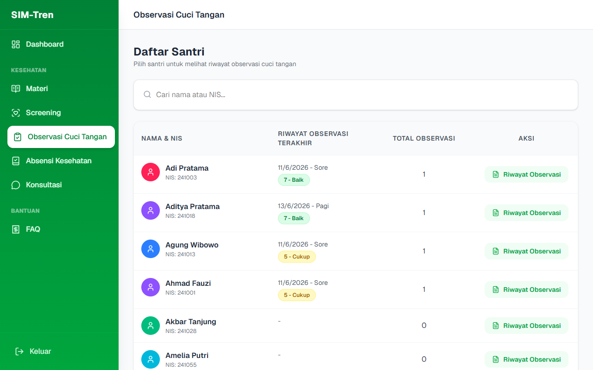
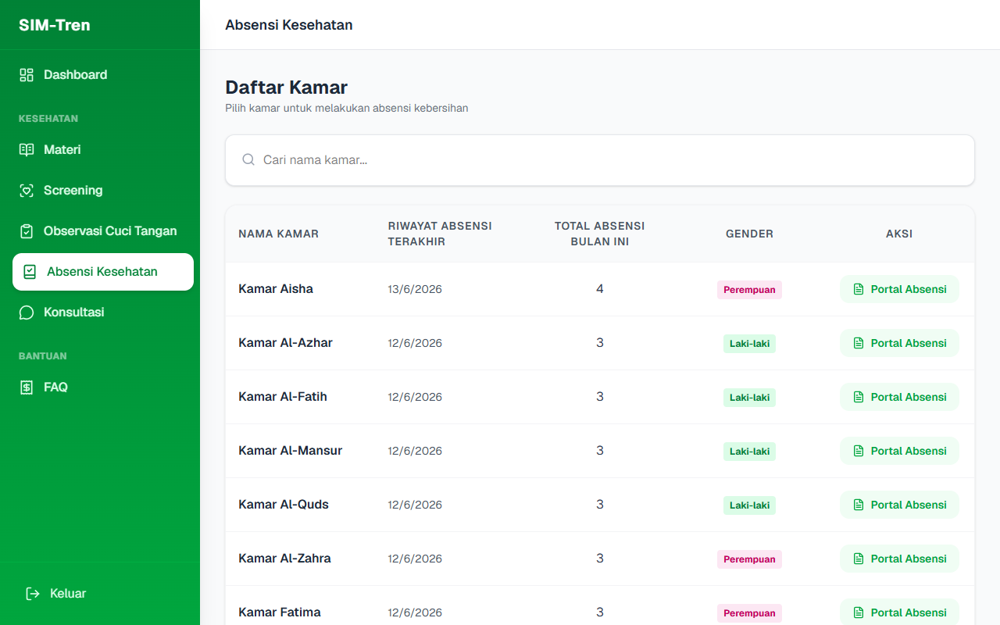
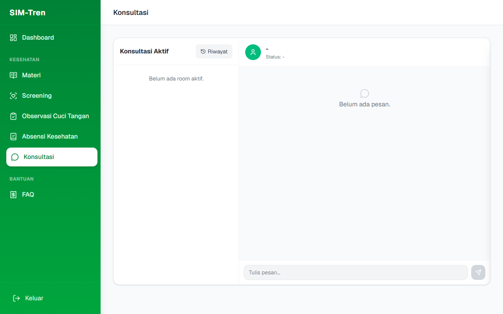
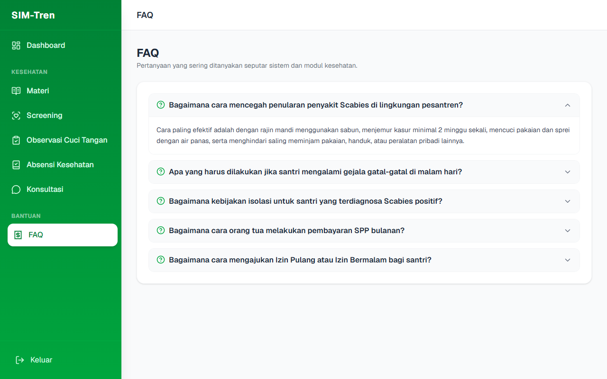

# BUKU PANDUAN PENGGUNAAN SIM-TREN
## ROLE: TIM KESEHATAN (MEDIS PESANTREN)

---

### DAFTAR ISI
1. **PENDAHULUAN**
2. **AKSES MASUK & DASHBOARD KESEHATAN**
3. **MANAJEMEN ARTIKEL & MATERI EDUKASI**
4. **PANDUAN SCREENING GEJALA SCABIES**
5. **PANDUAN OBSERVASI CUCI TANGAN**
6. **ABSENSI & KONDISI KESEHATAN KAMAR ASRAMA**
7. **SISTEM KONSULTASI ONLINE (CHAT WALI SANTRI)**
8. **FAQ**

---

### 1. PENDAHULUAN
**SIM-Tren (Sistem Informasi Manajemen Pesantren)** menempatkan pemantauan kesehatan santri sebagai pilar penting, khususnya dalam pencegahan dan pengendalian penularan penyakit scabies di lingkungan asrama.

Sebagai **Tim Kesehatan**, Anda bertanggung jawab penuh atas pencatatan rekam medis, pelaksanaan screening gejala scabies berkala, pengawasan kebiasaan sanitasi cuci tangan santri, serta pelayanan konsultasi keluhan kesehatan dari wali santri melalui fitur chat interaktif.

---

### 2. AKSES MASUK & DASHBOARD KESEHATAN
1. Buka halaman SIM-Tren di browser Anda.
2. Masukkan **Email Tim Kesehatan** (`timkes@ppdny.id`) dan **Kata Sandi** Anda.
3. Klik tombol **Masuk**.
4. Anda akan diarahkan ke **Dashboard Tim Kesehatan**.

Dashboard Kesehatan menampilkan parameter data medis yang krusial secara real-time:
- Jumlah santri yang sedang dirawat (sakit).
- Persentase kesembuhan scabies di asrama.
- Statistik grafik kasus scabies aktif dari bulan ke bulan.

---

### 3. MANAJEMEN ARTIKEL & MATERI EDUKASI
Tim Kesehatan memiliki akses untuk menyebarkan materi edukasi hidup bersih dan sehat (PHBS) serta penanganan mandiri scabies:
- Gunakan menu **Materi** untuk mengunggah artikel edukatif.
- Klik **Tambah Materi**, masukkan Judul, Kategori, Isi Materi (Rich Text), dan gambar sampul pendukung.
- Materi ini akan tampil secara otomatis di aplikasi santri dan wali santri.

---

### 4. PANDUAN SCREENING GEJALA SCABIES
Screening scabies dilakukan secara berkala atau ketika santri melaporkan adanya keluhan gatal-gatal di kulit:
1. Masuk ke menu **Screening**.
2. Pilih nama santri dari daftar, lalu klik **Mulai Screening**.
3. Jawab pertanyaan diagnosis klinis (contoh: Apakah gatal memburuk di malam hari? Apakah ada bintik berair di sela jari? Apakah teman sekamar mengalami gejala serupa?).
4. Unggah foto kondisi kulit santri jika diperlukan untuk dokumentasi rekam medis.
5. Klik **Simpan**. Sistem akan menyimpulkan status santri (contoh: *Suspek Scabies*, *Bukan Scabies*) berdasarkan algoritma medis terintegrasi.

---

### 5. PANDUAN OBSERVASI CUCI TANGAN
Untuk menekan angka infeksi scabies, tim kesehatan rutin menilai kedisiplinan hidup bersih santri:
1. Navigasi ke menu **Observasi Cuci Tangan**.
2. Klik nama santri yang diamati.
3. Berikan penilaian check-list berdasarkan 6 langkah mencuci tangan WHO (menggosok telapak, punggung tangan, sela jari, mengunci jari, ibu jari, dan ujung jari menggunakan sabun).
4. Klik **Simpan Skor**. Hasil observasi ini akan dikonversi menjadi persentase skor kepatuhan sanitasi.

---

### 6. ABSENSI & KONDISI KESEHATAN KAMAR ASRAMA
Melalui menu **Absensi Kesehatan**, Tim Kesehatan mencatat santri-santri yang tidak dapat mengikuti kegiatan belajar pesantren karena kondisi sakit:
- Anda dapat menyaring data per kamar asrama.
- Menambahkan laporan santri sakit lengkap dengan jenis penyakitnya (misal: Demam, Flu, Gatal-gatal).
- Hal ini membantu deteksi dini penyebaran virus atau parasit di dalam satu kamar tertentu.

---

### 7. SISTEM KONSULTASI ONLINE (CHAT WALI SANTRI)
Wali santri dapat mengajukan konsultasi kesehatan mengenai kondisi anak mereka yang sedang sakit di poskesren.
- Masuk ke menu **Konsultasi**.
- Anda akan melihat daftar pesan masuk dari wali santri.
- Klik chat aktif untuk memberikan arahan medis, resep obat yang diberikan pesantren, atau menyarankan santri dirujuk ke faskes luar (puskesmas/rumah sakit).

---

### 8. FAQ
Berisi panduan solusi cepat atas kendala penginputan data rekam medis santri.

